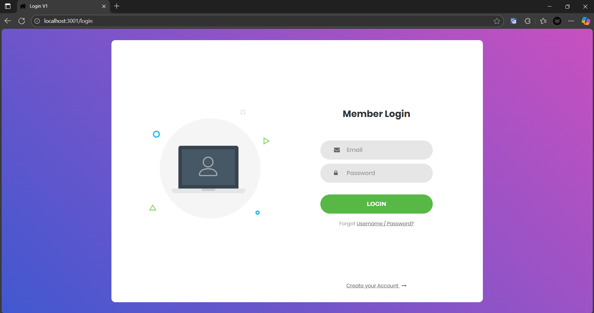
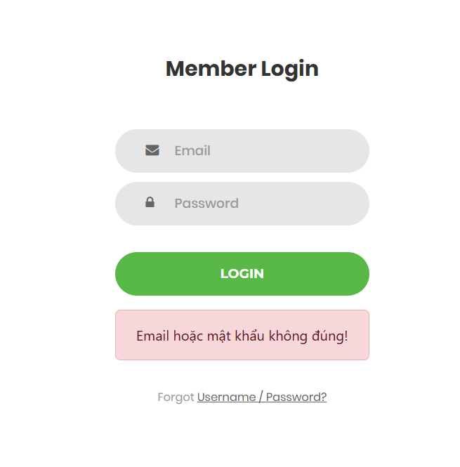
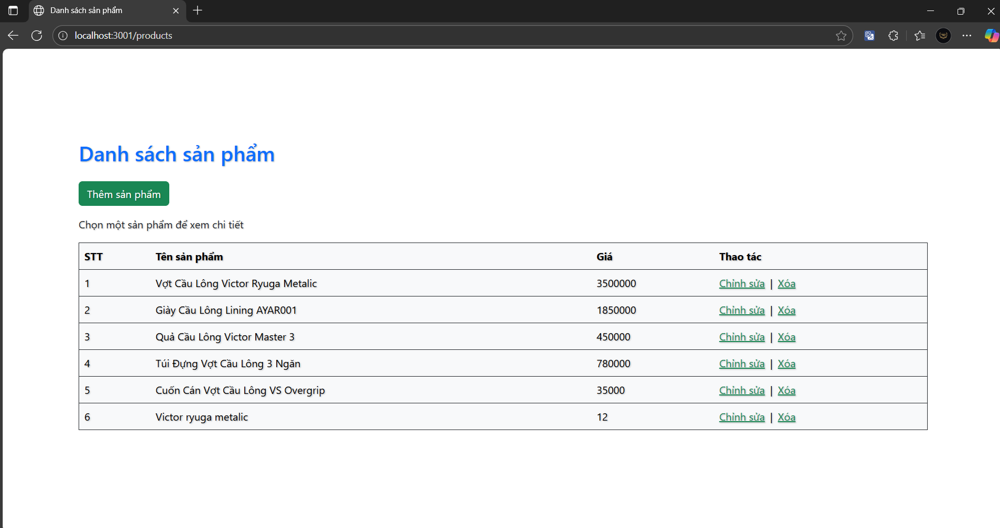
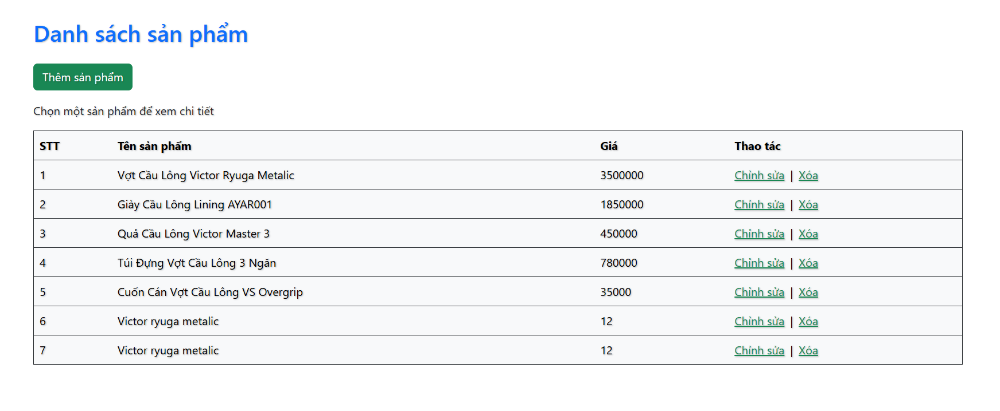

# Tổng quan mô hình MVC trong Express

```pgsql                    
                                                            ┌─────────────────────────────────────────────────┐
                                                            │                    SERVER                       │
    ┌───────────────────────────────────────┐               │                                                 │         ┌──────────────┐     
    │                                       │   (Req) (1)   │   ┌──────────────┐         ┌──────────────┐     │         │              │
    │                  Browser              │               |   │              │  (2)    │              │     │  (3)    │              │
    │      (Client: HTML / EJS / UI)        │ ───────────────►  │  Controller  │ ──────► │    Model     │  ──────────►  │      DB      │
    │                                       │               │   │              │ ◄────── │              │  ◄──────────  │              │
    └───────────────────────────────────────┘               │   └──────┬───────┘  (5)    └──────────────┘     │  (4)    │              │
                        ▲                                   │          │                                      │         └──────────────┘
                        │                                   │   + data │  (6)                                 │
                        │                                   │          │                                      │
                        │                                   │          ▼                                      │
                        │         (Res)  (7)                │       ┌──────────────┐                          │
                        └─────────────────────────────────────────  │     View     │                          │
                                                            │       └──────────────┘                          │
                                                            └─────────────────────────────────────────────────┘
```


# Giải thích từng bước hoạt động

Browser (Client)

- Gửi Request (Req) về Controller → ví dụ: GET /products.

Controller

- Nhận request từ browser.

- Gọi Model để xử lý dữ liệu (ví dụ truy vấn danh sách sản phẩm).

Model

- Gọi DB để đọc/ghi.

- Trả kết quả về lại cho Controller. 

Controller

- Nhận kết quả từ Model và kiểm tra:
  - Nếu success → trả về 200 OK + render lên View.
  - Nếu fail → trả về 404 (NULL),  401, 403,..vv

View
- Nhận thông tin từ controller.
- Nếu có data, dùng EJS/HTML để hiển thị ra giao diện cho Browser.

# Tóm gọn
```pgsql
Browser ⇆ Controller ⇆ Model ⇆ DB
                ↓
             +data
                ↓
              View
                ↓
              (Res)
```

# 🧩 Vị trí của Router trong MVC

Khi ta cài đặt với nodejs, giữa Browser và Controller còn có một đối tượng Router.

- Router sẽ xác định phần endpoint của url trang web
- Router là “người gác cổng”, chỉ xác định xem “đi đường nào, gọi ai” trên HTTP method.
- Không xử lý nghiệp vụ.
- Không render giao diện.

```pgsql
  (Req)    (1)                  (3)          cle(4)
Browser ────────►  Controller ─────► Model ─────► DB
            ▲
            │ (2)
          Router 
```

Khi user nhập http://localhost:3000/products thì '/products' chính là một endpoint.

- Thử đặt câu hỏi: Nếu không có Router thì sao?
- Về mặt kĩ thuật, Controller là nơi dev sẽ viết các function xử lý yêu cầu (vd: getOrder() getProduct(),...). 
  Nếu yêu cầu của user là xem sản phẩm thì `getProduct()` có thể giải quyết dc, nhưng câu hỏi là ai sẽ gửi yêu cầu đó cho `getProduct()` ? Đó chính là Router !
- Rõ ràng, nếu không có Router thì việc duy nhất mà user làm chỉ là đứng yên ở Home page http://localhost:3000 
- Điều này giống như order gà rán tại nhà từ KFC nhưng lại không có điện thoại để liên lạc vậy.

# Cấu trúc project cơ bản

Khi khởi tạo bằng express-generator, một project cơ bản sẽ có dạng như sau:
```pgsql
myapp/
  ├───── app.js
  ├───── bin/
  ├───── routes
  │         ├─ index.js 
  │         └─ users.js
  │                (tự tạo thêm:  productRouter.js, order.js)
  ├───── controllers/
  │              (tự tạo thêm: productController.js, authController.js)
  ├───── models/
  │         (tự tạo thêm: productModel.js)
  ├───── views/
  │         (EJS: index.ejs, login.ejs, add.ejs, productView.ejs...)
  └───── public/ 
            (static assets)
```

Code cơ bản như sau:

```js
// routes/productRouter.js
const express = require('express');
const router = express.Router();
const productController = require('../controller/productController');

router.get('/', productController.getProducts);
router.post('/add', productController.addProduct);

module.exports = router;
```

```js

// controllers/productController.js
exports.getProducts = (req, res) => {
  const products = [ ... ];
  res.render('product', { products });
};

```
# Kinh nghiệm từ những ngày đầu thực hành với Express MVC

Người ta nói "trăm hay không bằng tay quen". Cho nên dù hình vẽ MVC đã có sẵn nhưng nếu
chỉ nhìn vào rồi code theo thì cũng khá khoai :V. Với Express, mình luôn cảm thấy rối tung rối mù vì cách truyền callback vào từng middleware và từng method. Và sau khi chịu khó làm quen
(tất nhiên là phải có trợ thủ gpt bên cạnh kkk) thì mình đúc kết dc một số kinh nghiệm.

Mình trình bày cách code qua sơ đồ cụ thể như sau (lấy chức năng xem sản phẩm làm mẫu):

```js

Người dùng: http://localhost:3000/products    ◄───────────────────────┐
                │                                                     │
                ▼                                                     │ 
┌─────────────────────────────────────────────────────────┐           │
│                      app.js                             │           │
│---------------------------------------------------------│           │
│ const productRouter = require('./routes/productRouter') │           │
│ app.use('/products', productRouter)                     │           │
└─────────────────────────────────────────────────────────┘           │
              │                                                       │
              ▼                                                       │
┌──────────────────────────────────────────────┐                      │
│              routes/product.js               │                      │
│----------------------------------------------│                      │
│ const productController =                    │                      │
│  require('../controller/productController'); │                      │
│                                              │                      │
│ router.get('/', productController.getAll);   │                      │
│ router.post('/add', productController.add);  │                      │
└──────────────────────────────────────────────┘                      │
              │                                                       │
              ▼                                                       │
┌──────────────────────────────────────────────┐                      │
│       controllers/productController.js       │                      │
│----------------------------------------------│                      │
│ const Product = require('../models/product') │                      │
│                                              │          ┌──────────────────────────────────────────────┐
│ const getAll = (req, res)  => {              │          │              views/product.ejs               │
│   const products = Product.getAll();  ───────────────►  │----------------------------------------------│
│   res.render('product', { products });       │          │ Hiển thị dữ liệu từ getAll()                 │
│ }                                            │          └──────────────────────────────────────────────┘
|                                              |
│ const add = (req, res) => {                  │
│   Product.add(req.body);                     │
│   res.redirect('/products');                 │
| }                                            │
└──────────────────────────────────────────────┘
              │
              ▼
┌──────────────────────────────────────────────┐
│             models/product.js                │
│----------------------------------------------│
│   const data = [........]                    │
│                                              │
│   const getAll = () => {                     │
|      return data;                            │
│   }                                          │
│                                              │
│   add(newProduct) {                          │
│     data.push(newProduct);                   │
│   }                                          │
└──────────────────────────────────────────────┘
```

- Các thành phần trong mvc sẽ gọi lẫn nhau để xử lý tác vụ nên một khi sửa code một
  chỗ thì có thể phải sửa cả những chỗ khác. -> mò bug điên đầu luôn ! 

- Sơ đồ này không có thứ tự edit file nào là đúng hoàn toàn cả vì 
  khi truyền callback vào middleware, mình phải nhảy sang chỗ khác để viết cái callback đó.
  
  Ví dụ như đang viết dở route.get() trong route nhưng đứa này gọi tới callback `getAll`,
  thế là lại phải nhảy qua controller để định nghĩa `getAll`. Hoặc là lúc render data lên view 
  trong controller thì lại hứng lên sửa cái view cho thật đẹp đã :V.

- Một option khác nhưng mình thấy không khả thi lắm là xuất phát từ model -> controller -> route -> view -> app.js

## 🗣️ Góc hỏi đáp

Nhìn vào `app.js` và `routes/product.js`, ta đặt ra câu hỏi:
  
    Tại sao app gọi tới `productRouter` để điều hướng tới route '/products', 
    trong khi `productRouter` thì điều hướng tới chỗ khác như '/' hay '/add' ?
    Rồi rốt cuộc endpoint của mình ở đây là gì?

👉 Thực ra endpoint của Express có 2 cấp định tuyến (routing levels):

  1. app-level: Xác định tiền tố cho nhóm router
  2. router-level: Xác định route cho các http methods

Khi đó, Express sẽ ghép nối prefix + route: ```/products + /add = /products/add```

Đây mới chính là endpoint thực sự, điều đó có nghĩa rằng trên search bar người dùng phải nhập đầy đủ `http://localhost:3000/products/add` thì `productController.add` mới được gọi tới. Nếu chỉ dừng lại ở `http://localhost:3000/products` thì thứ dc gọi tới sẽ là `productController.getAll`.

---------------

Nhìn vào controller, ta đặt ra thêm câu hỏi:

    Những cái chuỗi truyền vào fn của `res`  có phải là route hay không ? (ví dụ `'product'` hoặc `'/product'`) 

  - Thực ra thì không phải cái chuỗi nào cũng là endpoint. Tùy vào fn đó có chức năng 
    gì mà parameters của nó có vai trò nhất định.
    
    Ví dụ:
      - `res.render()` là thứ đổ dữ liệu từ controller về view nên tham số `'product'` không phải endpoint mà là đường dẫn với file `views/product.ejs` 
      
      Trong app.js ta đã có dòng `app.set('view engine', 'ejs');` mặc định rằng định dạng 
      xuất ra là ejs chứ không phải html. Điều này thuận tiện cho dev vì đỡ phải chỉ định
      phần mở rộng của file.

      - Còn `'/product'` truyền vào `res.redirect()` mới là endpoint thực sự vì `res.redirect()` có chức năng điều hướng sang một route khác khi có một sự kiện nào đó xảy ra.
      
      Ví dụ như khi phiên đăng nhập hết hạn, người dùng sẽ được chuyển từ trang giới thiệu sản phẩm sang trang login. Và để làm điều đó thì controller mới can thiệp vào route thông qua `redirect()`.

# Kết quả demo

1. Trang login



2. login thất bại



3. Khi login thành công thì hiện ra danh sách sản phẩm



4. Thêm sản phẩm


5. Kết quả sau khi thêm

